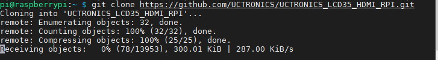
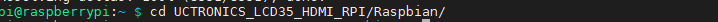
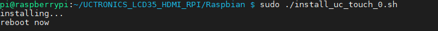

# Raspbian
- Step1: Download the driver
```bash
git clone https://github.com/UCTRONICS/UCTRONICS_LCD35_HDMI_RPI.git
```

- Step2: Go to the driver path 
```bash
cd UCTRONICS_LCD35_HDMI_RPI/Raspbian/
```

- Step3: Get the permisson 
```
sed -i -e 's/\r$//' *.sh
chmod +x *.sh
```
- Step4: install the driver
 

- Rotation 0
```bash
sudo ./install_uc_touch_0.sh
```
- Rotation 180
```bash
sudo ./install_uc_touch_180.sh
```
## Touch screen calibration

- Step1: Install calibration software
```bash
sudo ./calibrateToolInstall.sh
```

- Step2: Calibration screen
- Rotation 0
```bash
./calibration_uc_touch_0.sh /dev/input/event1
```
- Rotation 180
```bash
./calibration_uc_touch_180.sh /dev/input/event1
```

- Note: 
```bash
/dev/input/event1 is the input node of the touch screen, the user needs to view his own touch screen input node
```

- Step3: Tap the five dots on the screen in sequence and wait for the restart

# Octoprint
```bash
cd UCTRONICS_HSLCD35/Octoprint
```
```bash
sudo chmod +x UCTRONICS_HSLCD35_SHOW
```
```bash
sudo ./UCTRONICS_HSLCD35_SHOW
```
- Notice: When the rotation button is pressed, the touch driver does not support synchronous rotation.
  You should install the touch driver mannually.